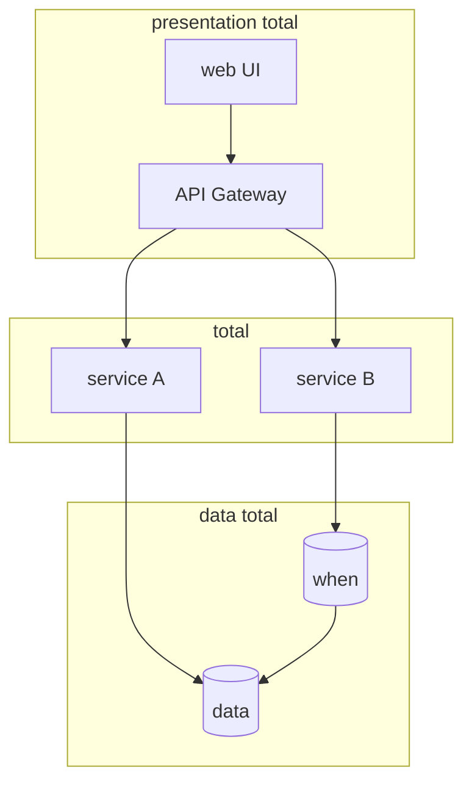
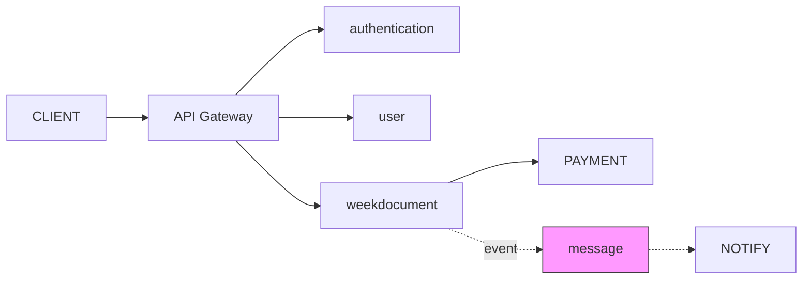
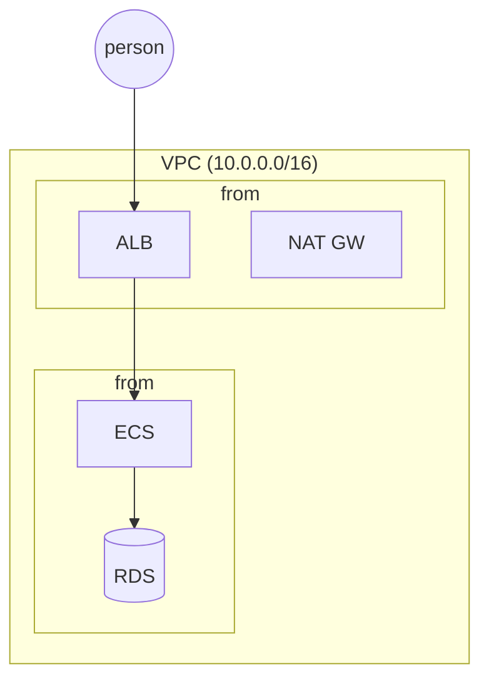
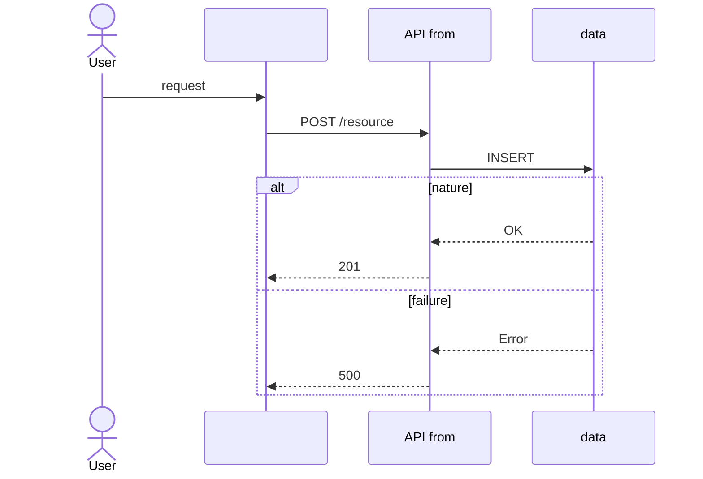
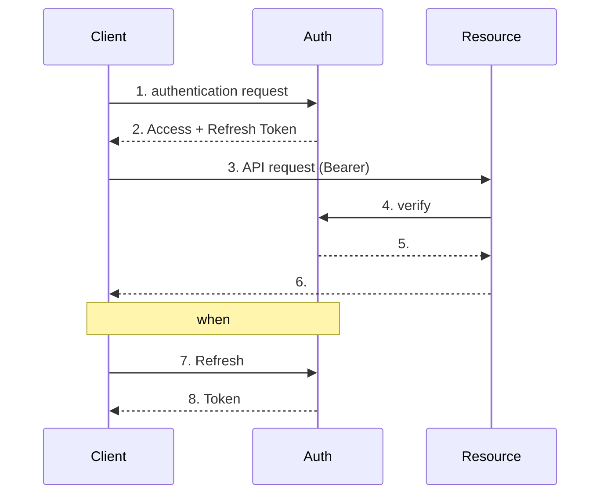
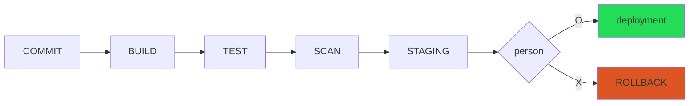

# Diagram Patterns — Mermaid diagram pattern library

diagram-maker agent diagram quality verifydone pattern .

## diagram pattern

### pattern 1: total (Layered Architecture)



**usage timing**: /total minute whensystem
**core rule**: subgraph total minute, TD direction, total 3-4 within

### pattern 2: service communication



**core rule**: basis=actual, basis=point, message 

### pattern 3: person degree



**core rule**: during subgraph= total, KRW =external

## when diagram pattern

### pattern 4: API (Happy Path + Error)



**core rule**: alt/else minutebasis, request=actual, =point

### pattern 5: OAuth 2.0 authentication flow



## flowchart pattern

### pattern 6: decision-making flow

```mermaid
flowchart TD
 START([whenwork]) --> CHECK{condition confirm}
 CHECK -->|A| PA[processing A]
 CHECK -->|B| PB[processing B]
 PA & PB --> VALIDATE{verify}
 VALIDATE -->|| DONE([complete])
 VALIDATE -->|failure| RETRY{re-when?}
 RETRY -->|example| CHECK
 RETRY -->|| ERROR([error])
```

**core rule**: =However, companyeach=whenwork/, =exchange table

### pattern 7: CI/CD pipeline



## ER diagram pattern

### pattern 8: data model

```mermaid
erDiagram
 USER ||--o{ ORDER : places
 ORDER ||--|{ ORDER_ITEM : contains
 ORDER_ITEM }o--|| PRODUCT : "refers to"
 USER { int id PK; string email UK; string name }
 ORDER { int id PK; int user_id FK; string status }
```

## status diagram pattern

### pattern 9: status before

```mermaid
stateDiagram-v2
 [*] --> number
 number --> versusbasis: confirm
 versusbasis --> complete: nature
 versusbasis --> : failure
 complete --> during: 
 during --> complete: number
 complete --> [*]
 --> [*]
```

## diagram quality checklist

| item | standard |
|------|------|
| number | 10items within |
| | 3~5 |
| table gap | 0items |
| /caption | all diagram included |
| | un- minute, versus 3 |
| subgraph | versus 2stage |

## planpattern

| planpattern | |
|---------|--------|
| (table gap) | re-arrangement, subgraph minute |
| Korean taxdepartmentmatters | level day |
| table | all total company |
| consistency | typeby day |
