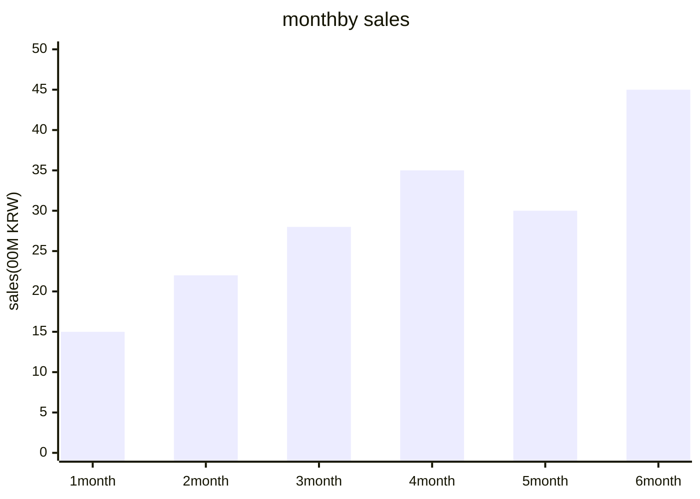
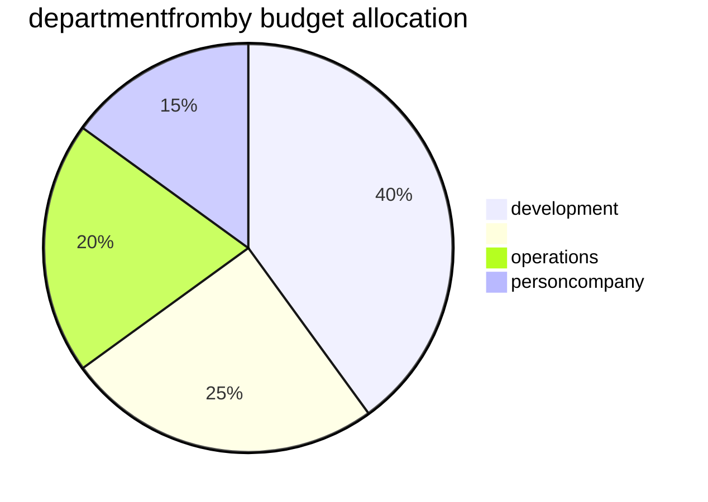

# Data Visualization Guide — data visualization guide

visualizer agent chart design quality visualization principle and pattern.

## chart optional framework

### data purposeby chart mapping

| purpose | recommendation chart | data condition |
|------|----------|-----------|
| comparison (item between) | versuschart, | week 2~15items |
| comparison (whentotal) | , chart | time required |
| composition/ratio | , quality versus, | total=100% |
| minute | , , point also | annualwithin figure |
| total | point, chart, | number 2~3items |
| flow/process | , | stageby figure |
| degree | , | position data |

### chart optional decision-making 

```
Q1: data number itemsperson?
├── 1items → minute confirm? → /
├── 2items → time ? → /
│ week? → versuschart
│ annualwithin? → point
└── 3items+ → chart//pyeongtable
```

## Mermaid based chart peopletax pattern

### versuschart (Bar Chart)



### / chart peopletax template



## visualization principle

### Edward Tufte principle applied

| principle | description | applied method |
|------|------|----------|
| data- ratio | neededKorean decoration | 3D effect, background pattern prohibited |
| work number | chart conditionby | departmentfromby/durationby minute |
| element | work prohibited | Y mustwhen 0 whenwork (versuschart) |
| data also | between versus information versus | minimization, integration |

### usage rule

| also | rule |
|------|------|
| order data | total basis (example: annualKorean →Korean ) |
| week data | from minute versus 7items |
| | core data only , degree |
| /department | =, =department (documentquality ) |
| nature | eachor morespecialist , pattern/ |

## design tablelevel

### comparison 

| item | Q1 | Q2 | Q3 | Q4 | YoY |
|------|-----|-----|-----|-----|---------|
| sales | 120 | 135 | 142 | 155 | +15.2% |
| profit | 18 | 22 | 25 | 28 | +22.1% |

**rule**:
- figure , 
- (increase=record, decrease=)
- 1,000 
- 1 specify

## report typeby visualization 

### monthbetween performance report

```
required chart tax:
1. sales — (goal vs results, beforeyear basis)
2. departmentdocumentby sales — quality versus
3. KPI naturerate — chart or degree
4. cost structure — chart
5. core indicator — scorecard (specialist + beforemonth )
```

### marketanalysis report

```
required chart tax:
1. market scale — chart (CAGR tablewhen)
2. competitor point — quality or 
3. price comparison — numberpyeong versus (competitorby)
4. SWOT — 2x2 matrix 
5. positioning — point also (2: price vs quality)
```

## quality checklist

| item | standard |
|------|------|
| title | all chart un- title |
| | included |
| source | data source specify |
| | 3items or more when when required |
| figure | core data point directly tablewhen |
| nature | person when also minute possible |
