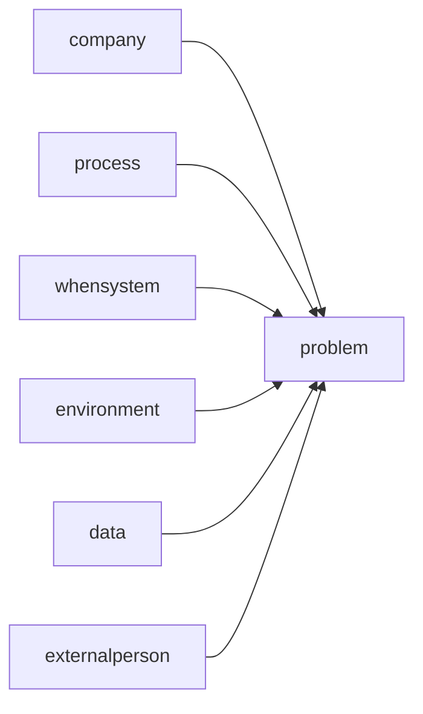

# Facilitation Techniques — facilitation technique library

agenda-architect / followup-planner agent meeting design competency technique .

## meeting typeby facilitation design

| meeting type | purpose | time | recommended technique |
|----------|------|------|----------|
| person | idea | 30~60minute | 6-3-5, |
| decision-making | /optional | 30~60minute | DACI, Dot Voting |
| problem | cause→ | 60~90minute | 5 Whys, when |
| strategyestablish | direction setting | 90~120minute | SWOT, scenario |
| | improvement derive | 45~60minute | Start-Stop-Continue |
| | / | 60~90minute | project |

## idea technique

### 6-3-5 Brainwriting

```
rule:
- 6people 
- eachspecialist 3items idea writing (5minute)
- companyto deliver → existing idea before/addition (5minute)
- 5 
- total calculation: versus 108items idea (30minute)

advantage: capability during degree, withinnaturequality participant report
```

### Lightning Demos (items demo)

```
1. each participant value case 1items preparation (companybefore)
2. 3minute demo/presentation
3. "Big Ideas" post basisrecord
4. → core idea derive
```

## problem technique

### 5 Whys structure

```
problem: [current technical]
Why 1: [current] occurrence? → [cause 1]
Why 2: [cause 1] occurrence? → [cause 2]
Why 3: [cause 2] occurrence? → [cause 3]
Why 4: [cause 3] occurrence? → [cause 4]
Why 5: [cause 4] occurrence? → [ cause]

→ cause regarding when action establish
```

### when diagram (Ishikawa)



6M category: Man, Method, Machine, Material, Measurement, Mother Nature

## time management technique

### guide

| | recommended time | versus |
|------|----------|------|
| | 5minute | 10minute |
| | 10minute | 15minute |
| itemsperson task  | 5~10minute | 15minute |
| debate | 10~15minute | 20minute |
| overall | person 2~3minute | person 5minute |
| decision-making | 10~15minute | 30minute |
| organization | 5minute | 10minute |

### Parking Lot (weekgap)

```
meeting during weekfrom debate occurrence:
1. " point. Parking Lot basisrecord"
2. by also report basisrecord
3. meeting before Parking Lot review
4. each item afterwithin action degree
```

## technique

### Start-Stop-Continue

| category | question |
|---------|------|
| **Start** | whenwork to do ? |
| **Stop** | to do ? |
| **Continue** | totalwithin to do ? |

### 4Ls 

| L | question |
|---|------|
| **Liked** | ? |
| **Learned** | ? |
| **Lacked** | insufficient ? |
| **Longed for** | ? |

## structure

### SMART 

| element | description | examplewhen |
|------|------|------|
| specific | to do person | "client document document plan writing" |
| possible | complete standard | "20document, 5minute within " |
| person responsible | | team |
| deadline | to | 1/31to |
| tracking method | from confirm | Jira PROJ-123 |

## quality checklist

| item | standard |
|------|------|
| agenda item time allocation | specify |
| participant role | actual/frombasis/ degree |
| Ground Rules | meeting whenwork when |
| balanced | techniqueas report ( etc.) |
| | SMART standard |
| Parking Lot | un- issue afterwithin degree |
