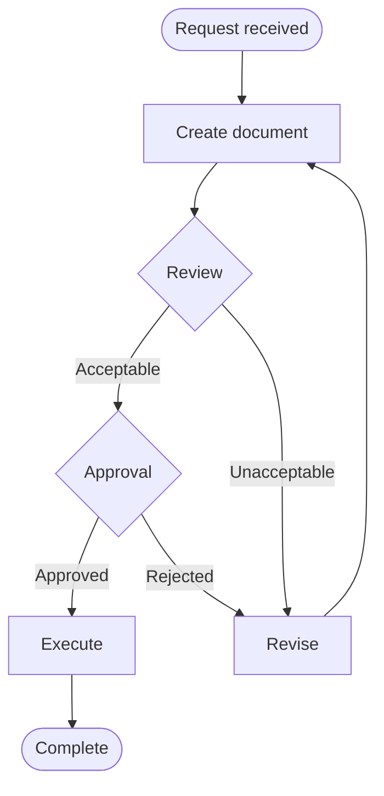
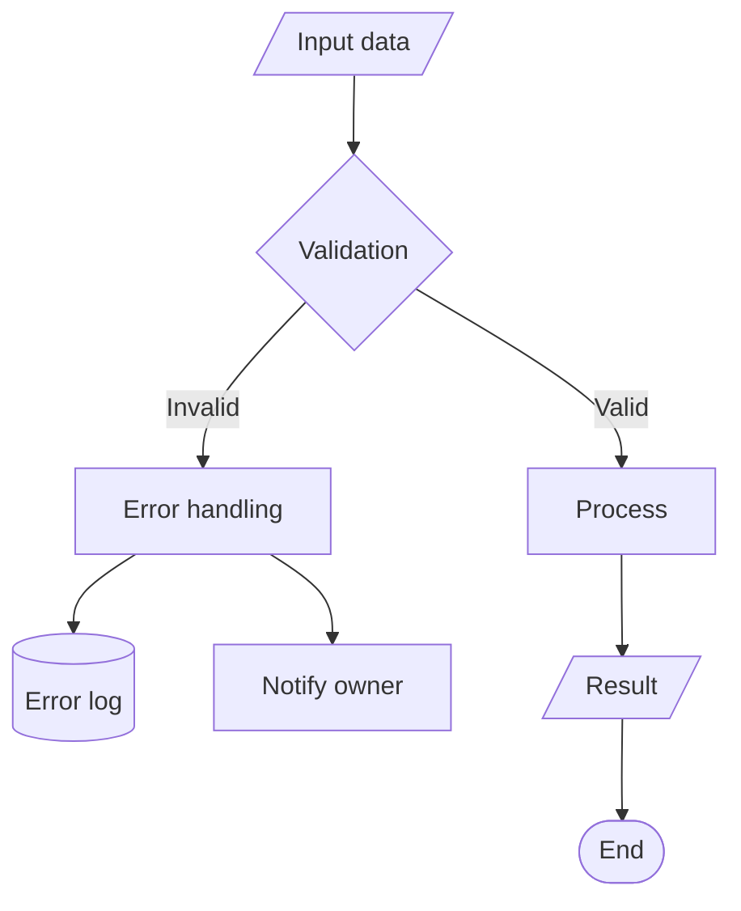
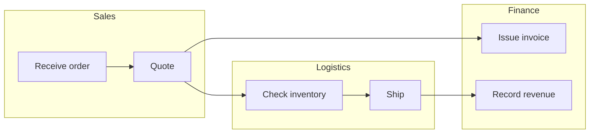

# Flowchart Standards — Process Flowchart Standards

Standardizes the flowchart-designer agent's process visualization quality.

## Standard Symbol System

| Symbol | Mermaid | Meaning | Usage |
|--------|---------|---------|-------|
| Rounded rectangle | `([text])` | Start/End | Process entry/exit |
| Rectangle | `[text]` | Processing/Task | Unit work activity |
| Diamond | `{text}` | Decision/Branch | Decision point |
| Parallelogram | `[/text/]` | Input/Output | Document/Data |
| Cylinder | `[(text)]` | Data store | DB/System |
| Subgraph | `subgraph` | Area grouping | Department/Phase |

## Process Type Patterns

### Pattern 1: Approval Process



### Pattern 2: With Error Handling



### Pattern 3: Parallel Processing (Swim Lanes)



## Complexity Management Rules

| Rule | Threshold | When Exceeded |
|------|-----------|---------------|
| Node count | 15 or fewer | Split into sub-processes |
| Branch depth | 3 levels or fewer | Create sub-flowcharts |
| Swim lanes | 4 or fewer | Split the process |
| Crossing lines | 0 | Rearrange layout |
| Text | Verb + object, 5 words max | Abbreviate |

## Process-Document Mapping

```
Flowchart ↔ Manual mapping:
  Each rectangle (task) in the flowchart = 1 procedure in the manual
  Each diamond (decision) in the flowchart = Decision criteria in the manual
  Each subgraph (area) in the flowchart = 1 chapter in the manual
```

## Quality Checklist

| Item | Criteria |
|------|----------|
| Start/End | Exactly 1 each must exist |
| Dead ends | None (all paths reach an endpoint) |
| Branch labels | Conditions specified for all paths |
| Exception paths | Includes error/rejection/timeout |
| Number mapping | Matches manual procedure numbers |
