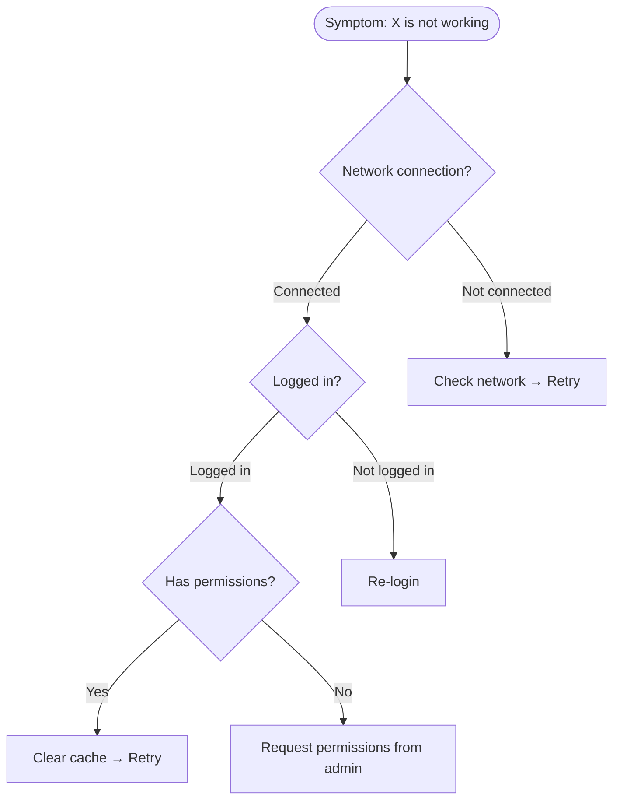

# Knowledge Base Design

Enhances the knowledge systematization capabilities of faq-builder / manual-writer agents.

## FAQ Design Principles

### FAQ Category Design

```
Step 1: User journey-based classification
  Getting started → Basic usage → Advanced features → Troubleshooting → Administration

Step 2: 5-10 questions per category
  - Sort by frequency (highest first)
  - Write questions in user language

Step 3: Cross-references
  - Link between related FAQs
  - Link to corresponding manual sections
```

### FAQ Writing Template

```markdown
## Q: [Question in the form users actually ask]

**A:** [1-2 sentence key answer]

[Detailed explanation if needed]

**Steps:**
1. [Specific action 1]
2. [Specific action 2]
3. [Specific action 3]

> Reference: [Link to related manual section]
> Related question: [Link to related FAQ]
```

### FAQ Quality Rules

| Rule | Description |
|------|-------------|
| Question = User language | Everyday expressions, not jargon |
| Answer = 1-line summary + details | Easy to scan |
| 1 FAQ = 1 topic | Split compound questions |
| Screenshots/diagrams | Include visual explanations |
| Updated date | Specify last verified date |

## Troubleshooting Guide Structure

### Symptom-Based Diagnostic Tree



### Troubleshooting Card Template

```markdown
## Problem: [Symptom description]

### Impact
- Scope: [All/Partial/Individual]
- Urgency: [Immediate/24 hours/72 hours]

### Possible Causes
| # | Cause | Likelihood | How to Verify |
|---|-------|-----------|---------------|
| 1 | [Most common cause] | High | [Verification command/method] |
| 2 | [Second cause] | Medium | [Verification command/method] |
| 3 | [Rare cause] | Low | [Verification command/method] |

### Resolution Steps
**If Cause 1:**
1. [Step 1]
2. [Step 2]
3. Verify: [Success criteria]

### Escalation
- Not resolved within 30 min → [L2 owner]
- Service outage → [Emergency contact]
```

## Knowledge Management Lifecycle

| Phase | Activity | Frequency |
|-------|----------|-----------|
| Create | Write new procedures/FAQs | As needed |
| Review | Verify accuracy/currency | Quarterly |
| Update | Reflect changes | As needed |
| Retire | Archive obsolete documents | Annually |
| Measure | Views, usefulness, feedback | Monthly |

## Search Optimization

| Technique | Description |
|-----------|-------------|
| Keyword tagging | Tags based on user search terms |
| Synonym mapping | "not working" = "error" = "failure" |
| Category hierarchy | Maximum 3 levels |
| Related document links | Up to 5 cross-references |
| Summary (Excerpt) | Summary displayed in search results |

## Quality Checklist

| Item | Criteria |
|------|----------|
| FAQ count | 5-10 per category |
| Troubleshooting | Covers top 10 issues |
| Diagnostic tree | Resolution reached in 3 steps or fewer |
| Escalation | Time-based criteria specified |
| Updated date | Displayed on all documents |
