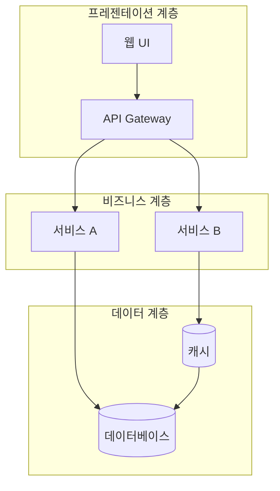
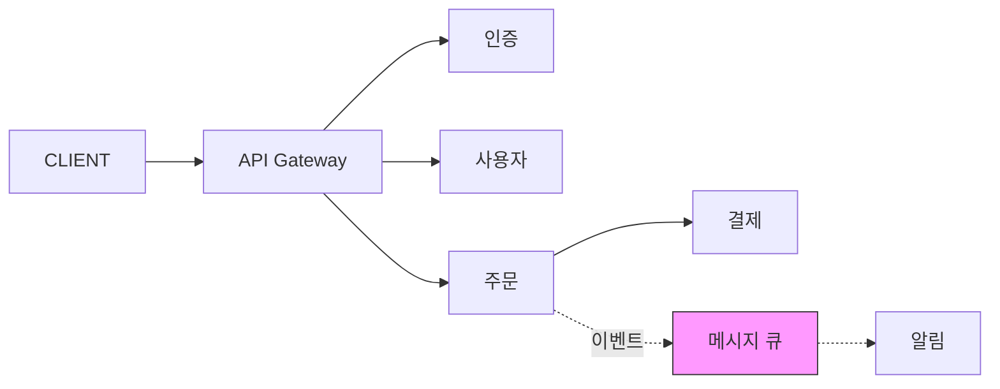
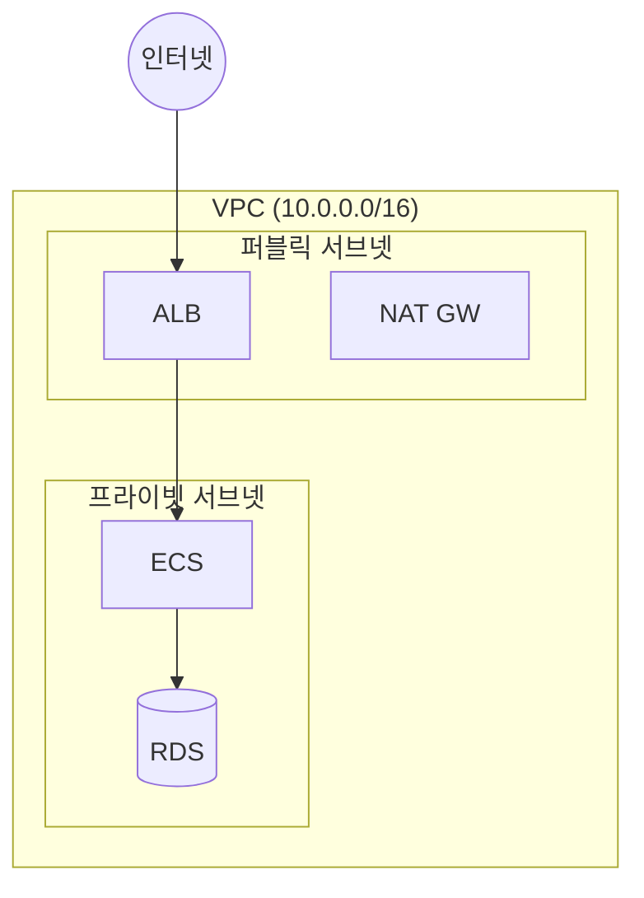
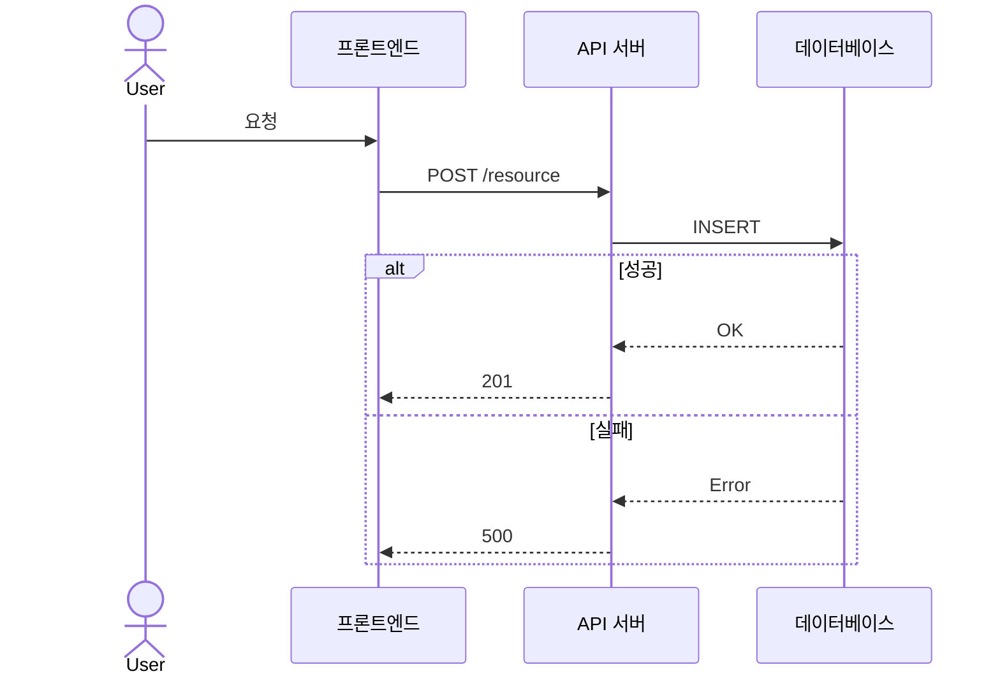
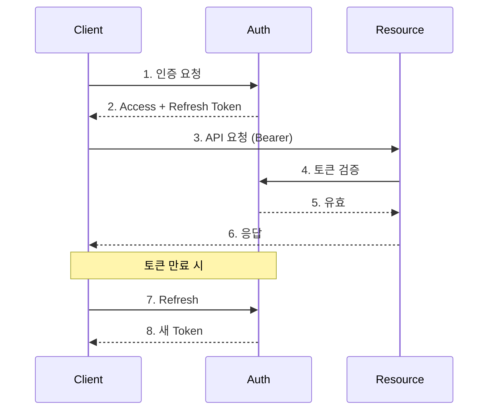
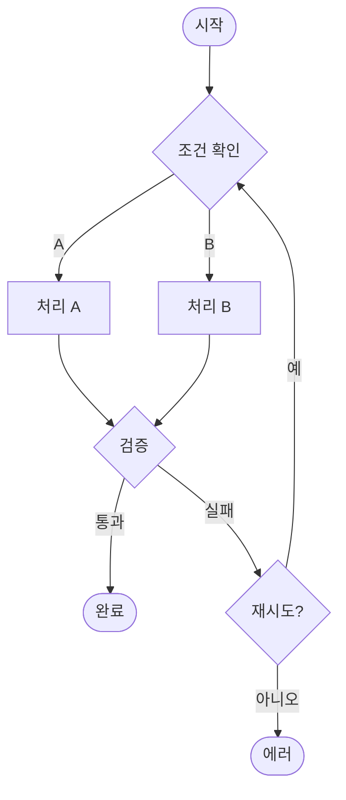
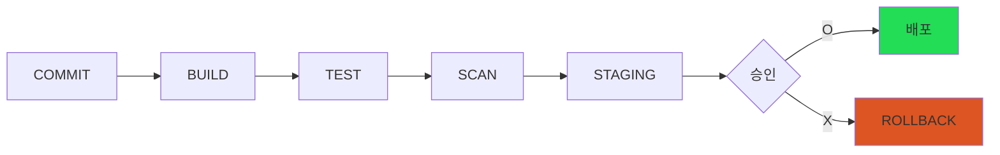
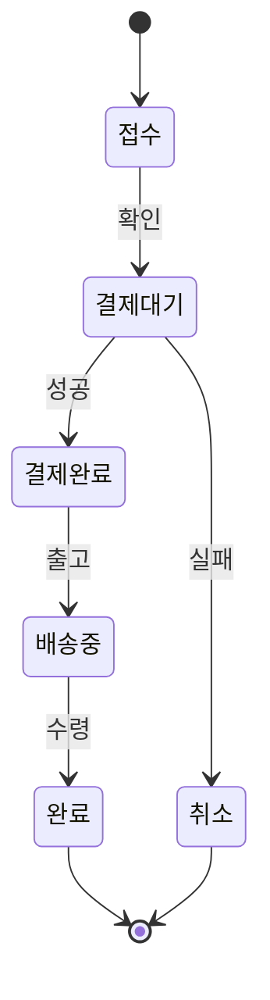

# Diagram Patterns — Mermaid 다이어그램 패턴 라이브러리

diagram-maker 에이전트의 다이어그램 품질을 높이는 검증된 패턴 모음.

## 아키텍처 다이어그램 패턴

### 패턴 1: 계층형 아키텍처 (Layered Architecture)



**사용 시점**: 모놀리식/계층 분리 시스템
**핵심 규칙**: subgraph로 계층 구분, TD 방향, 계층당 3-4 노드 이내

### 패턴 2: 마이크로서비스 통신



**핵심 규칙**: 동기=실선, 비동기=점선, 메시지 큐 색상 강조

### 패턴 3: 클라우드 인프라 토폴로지



**핵심 규칙**: 중첩 subgraph=네트워크 경계, 원형 노드=외부

## 시퀀스 다이어그램 패턴

### 패턴 4: API 호출 (Happy Path + Error)



**핵심 규칙**: alt/else 분기, 요청=실선, 응답=점선

### 패턴 5: OAuth 2.0 인증 흐름



## 플로차트 패턴

### 패턴 6: 의사결정 흐름도



**핵심 규칙**: 다이아몬드=판단, 둥근 사각형=시작/종료, 루프=순환 화살표

### 패턴 7: CI/CD 파이프라인



## ER 다이어그램 패턴

### 패턴 8: 데이터 모델

```mermaid
erDiagram
    USER ||--o{ ORDER : places
    ORDER ||--|{ ORDER_ITEM : contains
    ORDER_ITEM }o--|| PRODUCT : "refers to"
    USER { int id PK; string email UK; string name }
    ORDER { int id PK; int user_id FK; string status }
```

## 상태 다이어그램 패턴

### 패턴 9: 상태 전이



## 다이어그램 품질 체크리스트

| 항목 | 기준 |
|------|------|
| 노드 수 | 10개 이내 |
| 레이블 | 3~5단어 |
| 화살표 교차 | 0개 |
| 범례/캡션 | 모든 다이어그램에 포함 |
| 색상 | 의미 있는 구분에만, 최대 3색 |
| subgraph 깊이 | 최대 2단계 |

## 안티패턴

| 안티패턴 | 해결책 |
|---------|--------|
| 스파게티 (화살표 교차) | 노드 재배치, subgraph 분리 |
| 과도한 세부사항 | 추상화 수준 통일 |
| 레이블 없는 화살표 | 모든 관계에 동사형 레이블 |
| 일관성 없는 노드 모양 | 유형별 통일 |
