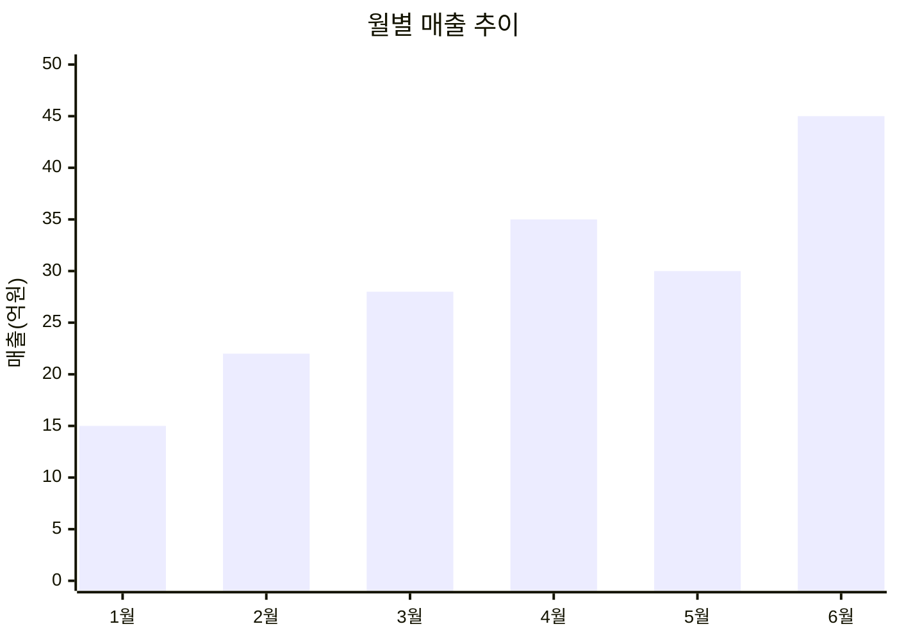
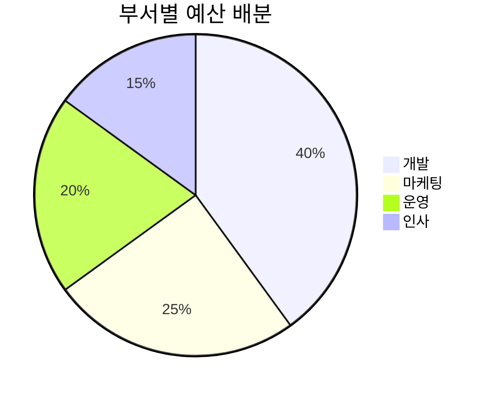

# Data Visualization Guide — 데이터 시각화 가이드

visualizer 에이전트의 차트 설계 품질을 높이는 시각화 원칙과 패턴.

## 차트 선택 프레임워크

### 데이터 목적별 차트 매핑

| 목적 | 추천 차트 | 데이터 조건 |
|------|----------|-----------|
| 비교 (항목 간) | 막대차트, 히트맵 | 범주형 2~15개 |
| 비교 (시계열) | 꺾은선, 영역차트 | 시간 축 필수 |
| 구성/비율 | 도넛, 누적 막대, 트리맵 | 합계=100% |
| 분포 | 히스토그램, 박스플롯, 산점도 | 연속형 수치 |
| 관계 | 산점도, 버블차트, 히트맵 | 변수 2~3개 |
| 흐름/프로세스 | 산키, 워터폴 | 단계별 수치 |
| 지리 | 코로플레스, 버블맵 | 위치 데이터 |

### 차트 선택 의사결정 트리

```
Q1: 데이터 변수가 몇 개인가?
├── 1개 → 분포 확인? → 히스토그램/박스플롯
├── 2개 → 시간 축? → 꺾은선/영역
│         범주형?  → 막대차트
│         연속형?  → 산점도
└── 3개+ → 버블차트/히트맵/평행좌표
```

## Mermaid 기반 차트 명세 패턴

### 막대차트 (Bar Chart)



### 파이/도넛 차트 명세 템플릿



## 시각화 원칙

### Edward Tufte 원칙 적용

| 원칙 | 설명 | 적용 방법 |
|------|------|----------|
| 데이터-잉크 비율 | 불필요한 장식 제거 | 3D 효과, 배경 패턴 금지 |
| 작은 배수 | 같은 차트를 조건별 나열 | 부서별/기간별 패널 분리 |
| 거짓말 요소 | 축 조작 금지 | Y축 반드시 0 시작 (막대차트) |
| 데이터 밀도 | 공간 대비 정보 최대화 | 여백 최소화, 범례 통합 |

### 색상 사용 규칙

| 용도 | 규칙 |
|------|------|
| 순서형 데이터 | 단색 계열 밝기 변화 (예: 연한 파랑→진한 파랑) |
| 범주형 데이터 | 서로 구분되는 색상 최대 7개 |
| 강조 | 핵심 데이터만 색상, 나머지 회색 |
| 긍정/부정 | 파랑=긍정, 빨강=부정 (문화적 관례) |
| 접근성 | 색각이상자 고려, 패턴/모양 병행 |

## 테이블 설계 표준

### 비교 테이블

| 항목 | Q1 | Q2 | Q3 | Q4 | YoY 변화 |
|------|-----|-----|-----|-----|---------|
| 매출 | 120 | 135 | 142 | 155 | +15.2% |
| 영업이익 | 18 | 22 | 25 | 28 | +22.1% |

**규칙**:
- 수치 우정렬, 텍스트 좌정렬
- 변화율은 색상 코딩 (증가=초록, 감소=빨강)
- 1,000단위 콤마 삽입
- 단위는 헤더에 1회 명시

## 보고서 유형별 시각화 조합

### 월간 실적 보고서

```
필수 차트 세트:
1. 매출 추이 — 꺾은선 (목표 vs 실적, 전년 동기)
2. 부문별 매출 — 누적 막대
3. KPI 달성률 — 불릿차트 또는 게이지
4. 비용 구조 — 도넛차트
5. 핵심 지표 — 스코어카드 (숫자 + 전월비 변화율)
```

### 시장분석 보고서

```
필수 차트 세트:
1. 시장 규모 추이 — 영역차트 (CAGR 표시)
2. 경쟁사 점유율 — 누적 영역 또는 도넛
3. 가격 비교 — 수평 막대 (경쟁사별)
4. SWOT — 2x2 매트릭스 테이블
5. 포지셔닝 맵 — 산점도 (2축: 가격 vs 품질)
```

## 품질 체크리스트

| 항목 | 기준 |
|------|------|
| 제목 | 모든 차트에 의미 있는 제목 |
| 축 레이블 | 단위 포함 |
| 출처 | 데이터 출처 명시 |
| 범례 | 3개 이상 시리즈 시 필수 |
| 수치 레이블 | 핵심 데이터 포인트에 직접 표시 |
| 접근성 | 흑백 인쇄 시에도 구분 가능 |
