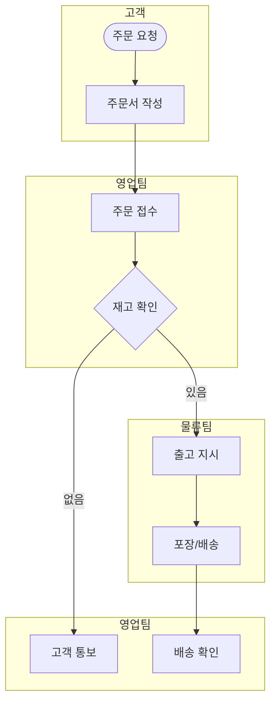

# Process Mapping — 프로세스 매핑 방법론

process-analyst 에이전트의 업무 흐름 분석 품질을 높이는 매핑 기법.

## SIPOC 분석 프레임워크

### SIPOC 템플릿

| S (Supplier) | I (Input) | P (Process) | O (Output) | C (Customer) |
|-------------|-----------|-------------|-----------|-------------|
| 공급자/이전단계 | 입력 자원/정보 | 핵심 프로세스 | 산출물 | 고객/다음단계 |

### 작성 규칙
1. **Process 먼저** — 핵심 프로세스 5~7단계를 먼저 정의
2. **Output 다음** — 각 단계의 산출물 명시
3. **Customer 식별** — 산출물의 수신자
4. **Input 역추적** — 프로세스 수행에 필요한 입력
5. **Supplier 파악** — 입력의 공급자

### 예시: 고객 주문 처리

| S | I | P | O | C |
|---|---|---|---|---|
| 고객 | 주문서 | 1. 주문 접수 | 접수 확인 | 고객 |
| 재고 시스템 | 재고 정보 | 2. 재고 확인 | 가용 여부 | 물류팀 |
| 결제 시스템 | 결제 정보 | 3. 결제 처리 | 결제 완료 | 재무팀 |
| 물류팀 | 상품 | 4. 포장/출고 | 송장 | 배송사 |
| 배송사 | 송장 | 5. 배송 | 수령 확인 | 고객 |

## 프로세스 맵 표기법

### BPMN 간소화 표기

| 기호 | Mermaid 표현 | 의미 |
|------|-------------|------|
| 원 | `((시작))` | 시작/종료 이벤트 |
| 사각형 | `[작업]` | 태스크/활동 |
| 다이아몬드 | `{판단}` | 게이트웨이 (분기) |
| 수영장 | `subgraph` | 부서/역할 구분 |

### 크로스 펑셔널 맵 (Swim Lane)



## Value Stream Mapping (VSM)

### 현행 프로세스 분석 지표

| 지표 | 약어 | 설명 | 산출 |
|------|------|------|------|
| 리드타임 | LT | 시작~완료 총 시간 | 대기 + 처리 합산 |
| 처리시간 | PT | 실제 작업 시간 | 순수 가치 활동 |
| 대기시간 | WT | 단계 간 대기 | LT - PT |
| 효율 | PCE | 프로세스 사이클 효율 | PT / LT × 100 |

### VSM 분석 템플릿

```
단계 1: [작업명]
  처리시간: 30분
  대기시간: 2시간
  담당: 영업팀
  도구: CRM
  병목: ■ (있음/없음)

단계 2: [작업명]
  ...

총 리드타임: 24시간
총 처리시간: 3시간
PCE: 12.5% → 개선 목표: 30%
```

## RACI 매트릭스

| 역할 | 의미 | 규칙 |
|------|------|------|
| **R** (Responsible) | 실행 담당 | 각 활동에 1명 이상 |
| **A** (Accountable) | 최종 승인 | 각 활동에 반드시 1명만 |
| **C** (Consulted) | 자문 | 사전 의견 수렴 필요 |
| **I** (Informed) | 통보 | 결과만 공유 |

### RACI 작성 예시

| 활동 | 팀장 | 담당자 | QA | 임원 |
|------|------|--------|-----|------|
| 요구사항 정의 | A | R | C | I |
| 절차서 초안 | C | R | I | - |
| 리뷰/승인 | A | I | R | I |
| 배포 | A | R | - | I |

## 병목/낭비 식별 체크리스트

### 7대 낭비 (TIM WOODS)

| 낭비 | 설명 | SOP 적용 |
|------|------|---------|
| **T**ransport | 불필요한 이동/전달 | 승인 단계 과다 |
| **I**nventory | 과잉 재고/체류 | 처리 대기 문서 적체 |
| **M**otion | 불필요한 동작 | 시스템 간 데이터 재입력 |
| **W**aiting | 대기 시간 | 승인 대기, 회신 대기 |
| **O**verproduction | 과잉 생산 | 불필요한 보고서/양식 |
| **O**verprocessing | 과잉 처리 | 과도한 검증 단계 |
| **D**efects | 결함/재작업 | 오류로 인한 반복 작업 |
| **S**kills | 인재 낭비 | 과잉 자격자의 단순 작업 |

## 품질 체크리스트

| 항목 | 기준 |
|------|------|
| SIPOC 완성도 | 5요소 모두 식별 |
| 프로세스 단계 | 5~15단계 (초과 시 하위 프로세스 분리) |
| 담당자 명시 | 모든 단계에 R/A 지정 |
| 시간 측정 | LT, PT, WT 산출 |
| 병목 식별 | 최소 1개 이상 개선 포인트 |
