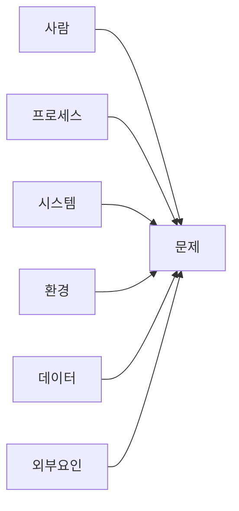

# Facilitation Techniques — 퍼실리테이션 기법 라이브러리

agenda-architect / followup-planner 에이전트의 회의 설계 역량을 강화하는 기법 모음.

## 회의 유형별 퍼실리테이션 설계

| 회의 유형 | 목적 | 시간 | 권장 기법 |
|----------|------|------|----------|
| 브레인스토밍 | 아이디어 발산 | 30~60분 | 6-3-5, 라운드로빈 |
| 의사결정 | 합의/선택 | 30~60분 | DACI, Dot Voting |
| 문제해결 | 근본원인→해결 | 60~90분 | 5 Whys, 피시본 |
| 전략수립 | 방향 설정 | 90~120분 | SWOT, 시나리오 |
| 회고 | 개선 도출 | 45~60분 | Start-Stop-Continue |
| 킥오프 | 정렬/공유 | 60~90분 | 프로젝트 캔버스 |

## 아이디어 발산 기법

### 6-3-5 Brainwriting

```
규칙:
- 6명 참가
- 각자 3개 아이디어 작성 (5분)
- 옆 사람에게 전달 → 기존 아이디어 발전/추가 (5분)
- 5라운드 반복
- 총 산출: 최대 108개 아이디어 (30분)

장점: 발언력 편중 방지, 내성적 참가자 참여 보장
```

### Lightning Demos (번개 데모)

```
1. 각 참가자가 벤치마크 사례 1개 준비 (사전)
2. 3분씩 데모/발표
3. "Big Ideas" 포스트잇에 영감 기록
4. 클러스터링 → 핵심 아이디어 도출
```

## 문제해결 기법

### 5 Whys 구조

```
문제: [현상 기술]
Why 1: 왜 [현상]이 발생했는가? → [원인 1]
Why 2: 왜 [원인 1]이 발생했는가? → [원인 2]
Why 3: 왜 [원인 2]이 발생했는가? → [원인 3]
Why 4: 왜 [원인 3]이 발생했는가? → [원인 4]
Why 5: 왜 [원인 4]이 발생했는가? → [근본 원인]

→ 근본 원인에 대한 시정 조치 수립
```

### 피시본 다이어그램 (Ishikawa)



6M 카테고리: Man, Method, Machine, Material, Measurement, Mother Nature

## 시간 관리 기법

### 타임박스 가이드

| 활동 | 권장 시간 | 최대 |
|------|----------|------|
| 아이스브레이커 | 5분 | 10분 |
| 컨텍스트 공유 | 10분 | 15분 |
| 개인 작업 (조용히) | 5~10분 | 15분 |
| 소그룹 토론 | 10~15분 | 20분 |
| 전체 공유 | 인당 2~3분 | 인당 5분 |
| 의사결정 | 10~15분 | 30분 |
| 팔로업 정리 | 5분 | 10분 |

### Parking Lot (주차장)

```
회의 중 본 주제에서 벗어나는 토론이 발생하면:
1. "좋은 포인트입니다. Parking Lot에 기록하겠습니다"
2. 별도 보드에 기록
3. 회의 종료 전 Parking Lot 리뷰
4. 각 항목의 후속 조치 지정
```

## 회고 기법

### Start-Stop-Continue

| 카테고리 | 질문 |
|---------|------|
| **Start** | 새로 시작해야 할 것은? |
| **Stop** | 멈춰야 할 것은? |
| **Continue** | 계속해야 할 것은? |

### 4Ls 회고

| L | 질문 |
|---|------|
| **Liked** | 좋았던 것은? |
| **Learned** | 배운 것은? |
| **Lacked** | 부족했던 것은? |
| **Longed for** | 바랐던 것은? |

## 팔로업 구조화

### SMART 액션아이템

| 요소 | 설명 | 예시 |
|------|------|------|
| 구체적 | 무엇을 할 것인가 | "고객 설문 문항 초안 작성" |
| 측정 가능 | 완료 기준 | "20문항, 5분 이내 소요" |
| 담당자 | 누가 | 김팀장 |
| 기한 | 언제까지 | 1/31까지 |
| 추적 방법 | 어디서 확인 | Jira PROJ-123 |

## 품질 체크리스트

| 항목 | 기준 |
|------|------|
| 안건당 시간 배분 | 타임박스 명시 |
| 참가자 역할 | 퍼실리테이터/서기/타임키퍼 지정 |
| Ground Rules | 회의 시작 시 공유 |
| 발언 균형 | 기법으로 보장 (라운드로빈 등) |
| 액션아이템 | SMART 기준 충족 |
| Parking Lot | 미해결 이슈 후속 지정 |
