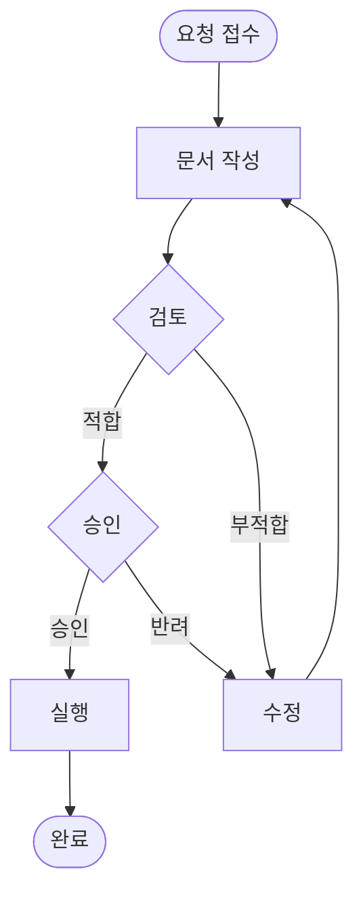
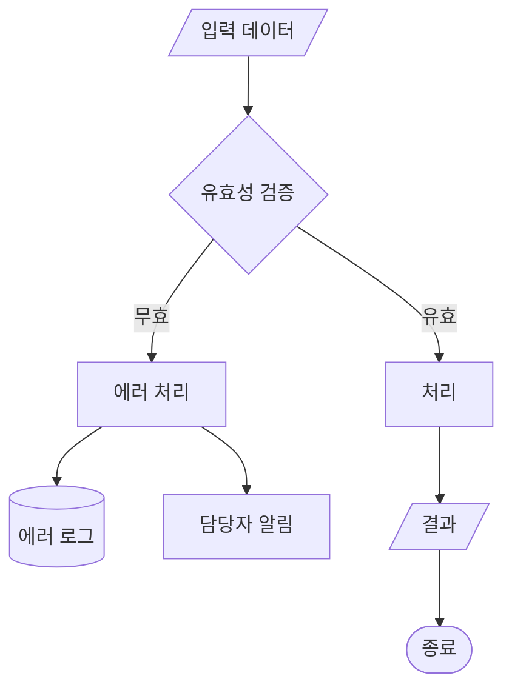
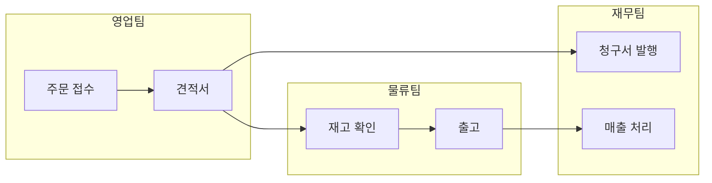

# Flowchart Standards — 프로세스 플로차트 표준

flowchart-designer 에이전트의 프로세스 시각화 품질 표준화.

## 표준 기호 체계

| 기호 | Mermaid | 의미 | 사용 |
|------|---------|------|------|
| 둥근 사각형 | `([텍스트])` | 시작/종료 | 프로세스 진입/종료 |
| 사각형 | `[텍스트]` | 처리/작업 | 단위 업무 활동 |
| 다이아몬드 | `{텍스트}` | 판단/분기 | 의사결정 |
| 평행사변형 | `[/텍스트/]` | 입력/출력 | 문서/데이터 |
| 원통 | `[(텍스트)]` | 데이터저장 | DB/시스템 |
| 서브그래프 | `subgraph` | 영역 구분 | 부서/단계 |

## 프로세스 유형별 패턴

### 패턴 1: 승인 프로세스



### 패턴 2: 에러 처리 포함



### 패턴 3: 병렬 처리 (Swim Lane)



## 복잡도 관리 규칙

| 규칙 | 기준 | 초과 시 |
|------|------|--------|
| 노드 수 | 15개 이내 | 하위 프로세스 분리 |
| 분기 깊이 | 3단계 이내 | 하위 플로차트 |
| Swim Lane | 4개 이내 | 프로세스 분할 |
| 교차선 | 0개 | 레이아웃 재배치 |
| 텍스트 | 동사+목적어, 5단어 | 축약 |

## 프로세스 문서 연계

```
플로차트 ←→ 매뉴얼 매핑:
  플로차트의 각 사각형(작업) = 매뉴얼의 1개 절차
  플로차트의 다이아몬드(판단) = 매뉴얼의 의사결정 기준
  플로차트의 서브그래프(영역) = 매뉴얼의 1개 장(Chapter)
```

## 품질 체크리스트

| 항목 | 기준 |
|------|------|
| 시작/종료 | 반드시 1개씩 존재 |
| 데드엔드 | 없음 (모든 경로 종료 도달) |
| 분기 레이블 | 모든 경로에 조건 명시 |
| 예외 경로 | 에러/거부/타임아웃 포함 |
| 번호 매핑 | 매뉴얼 절차 번호와 일치 |
