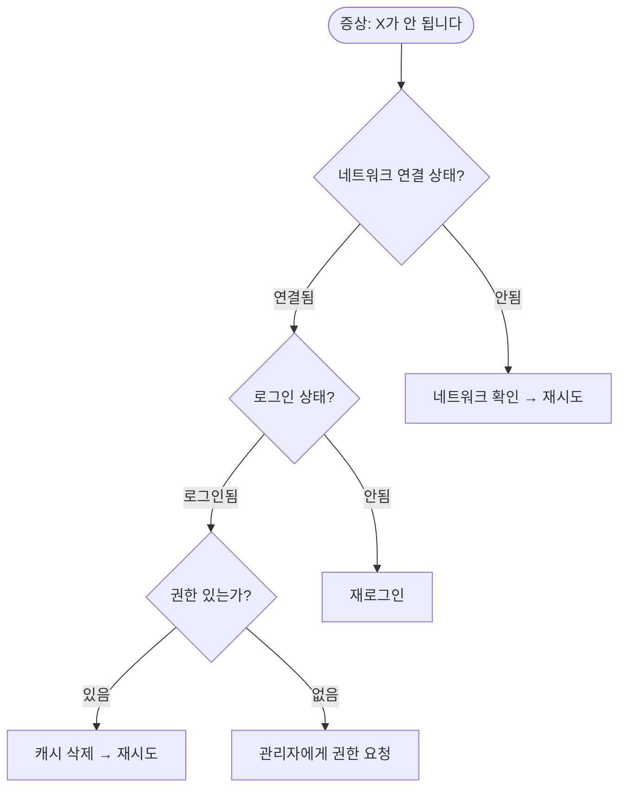

# Knowledge Base Design — 지식 베이스 구축 가이드

faq-builder / manual-writer 에이전트의 지식 체계화 역량 강화.

## FAQ 설계 원칙

### FAQ 카테고리 설계

```
1단계: 사용자 여정 기반 분류
  시작하기 → 기본 사용 → 고급 기능 → 트러블슈팅 → 관리

2단계: 각 카테고리 5~10개 질문
  - 빈도 높은 순 정렬
  - 질문은 사용자 언어로

3단계: 크로스 레퍼런스
  - 관련 FAQ 간 링크
  - 매뉴얼 해당 섹션 링크
```

### FAQ 작성 템플릿

```markdown
## Q: [사용자가 실제로 묻는 형태의 질문]

**A:** [1~2문장 핵심 답변]

[필요 시 상세 설명]

**단계:**
1. [구체적 행동 1]
2. [구체적 행동 2]
3. [구체적 행동 3]

> 참고: [관련 매뉴얼 섹션 링크]
> 관련 질문: [관련 FAQ 링크]
```

### FAQ 품질 규칙

| 규칙 | 설명 |
|------|------|
| 질문 = 사용자 언어 | 전문용어 아닌 일상 표현 |
| 답변 = 1줄 요약 + 상세 | 스캔하기 쉽게 |
| 1 FAQ = 1 주제 | 복합 질문은 분리 |
| 스크린샷/다이어그램 | 시각적 설명 포함 |
| 갱신 날짜 | 마지막 검증일 명시 |

## 트러블슈팅 가이드 구조

### 증상 기반 진단 트리



### 트러블슈팅 카드 템플릿

```markdown
## 문제: [증상 설명]

### 영향
- 영향 범위: [전체/부분/개인]
- 긴급도: [즉시/24시간/72시간]

### 원인 후보
| # | 원인 | 확률 | 확인 방법 |
|---|------|------|----------|
| 1 | [가장 흔한 원인] | 높음 | [확인 명령/방법] |
| 2 | [두 번째 원인] | 중간 | [확인 명령/방법] |
| 3 | [드문 원인] | 낮음 | [확인 명령/방법] |

### 해결 절차
**원인 1일 경우:**
1. [단계 1]
2. [단계 2]
3. 확인: [성공 기준]

### 에스컬레이션
- 30분 내 미해결 → [L2 담당자]
- 서비스 장애 → [긴급 연락처]
```

## 지식 관리 수명주기

| 단계 | 활동 | 주기 |
|------|------|------|
| 생성 | 신규 절차/FAQ 작성 | 수시 |
| 검토 | 정확성/최신성 확인 | 분기 |
| 갱신 | 변경사항 반영 | 수시 |
| 폐기 | 불필요 문서 아카이브 | 연간 |
| 측정 | 조회수, 유용성, 피드백 | 월간 |

## 검색성 최적화

| 기법 | 설명 |
|------|------|
| 키워드 태깅 | 사용자 검색어 기반 태그 |
| 동의어 매핑 | "안 됨" = "오류" = "에러" |
| 카테고리 계층 | 최대 3단계 |
| 관련 문서 링크 | 상호 참조 5개 이내 |
| 요약 (Excerpt) | 검색 결과에 표시될 요약 |

## 품질 체크리스트

| 항목 | 기준 |
|------|------|
| FAQ 수 | 카테고리당 5~10개 |
| 트러블슈팅 | 상위 10개 문제 커버 |
| 진단 트리 | 3단계 이내 해결 도달 |
| 에스컬레이션 | 시간 기준 명시 |
| 갱신 날짜 | 모든 문서에 표시 |
